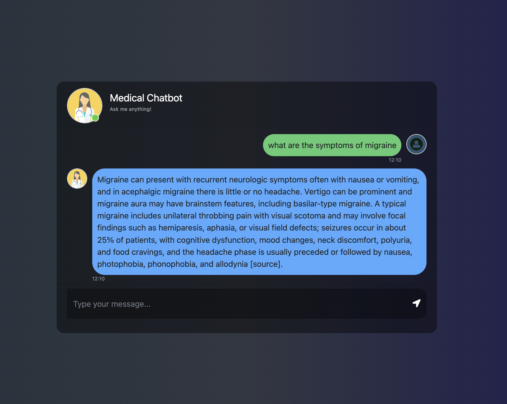

# Medical Chat Bot

A Retrieval-Augmented Generation (RAG) medical chatbot built with Flask, LangChain, Pinecone, and OpenAI.



Try it out by asking a focused clinical question or reviewing a topic you are currently studying. This demo uses
**Harrison's Principles of Internal Medicine, 20th Edition** as the source corpus for retrieval and citations.

## Who It Is For
This app is designed for medical students and clinicians who work with large and frequently updated medical knowledge:
- **Medical students** who need fast, reliable retrieval for study and review.
- **Physicians and healthcare professionals** who need efficient lookup as guidelines and references evolve.
- Teams who want a practical way to **index, refresh, and query** medical PDFs as a living knowledge base.


## What It Does
- Loads PDF documents from a local `data/` folder
- Splits and embeds them using a HuggingFace model
- Stores embeddings in a Pinecone index
- Serves a web UI to ask questions and retrieve answers grounded in the PDFs

## Project Structure
- `app.py` — Flask web app and RAG pipeline
- `store_index.py` — Builds and stores the vector index in Pinecone
- `src/helper.py` — PDF loading, chunking, and embeddings
- `src/prompt.py` — System prompt for the assistant
- `templates/chat.html` — Frontend UI
- `static/` — CSS and assets

## Prerequisites
- Python 3.9+ (3.10 or 3.11 recommended)
- Pinecone account + API key
- OpenAI API key

## Setup

### 1) Clone and enter the project
```bash
cd /medical-chat-bot
```

### 2) Create and activate a virtual environment
```bash
python3 -m venv .venv
source .venv/bin/activate
```

### 3) Install dependencies
```bash
pip install -r requirements.txt
```

### 4) Add API keys
Create a `.env` file in the project root:
```
OPENAI_API_KEY=your_openai_key
PINECONE_API_KEY=your_pinecone_key
```

### 5) Add PDF data
Create the `data/` folder (if it doesn’t exist) and add PDFs:
```bash
mkdir -p data
```
Put your PDF files inside `data/`.

## Build the Vector Index (First Run)
This step reads PDFs from `data/` and stores embeddings in Pinecone:
```bash
python store_index.py
```

If the index doesn’t exist, it will be created as `medical-chatbot` in Pinecone.

## Run the App
```bash
python app.py
```

Open your browser at:
```
http://localhost:8080
```

## Deployment Notes
If you deploy on Render (or any platform that expects a production server), the start command is:
```bash
gunicorn app:app --bind 0.0.0.0:$PORT
```
Meaning:
- `app:app` points to the Flask instance named `app` inside `app.py`
- `0.0.0.0:$PORT` binds to all network interfaces on the port provided by the platform

## Notes
- The app uses the Pinecone index name `medical-chatbot` (see `app.py` and `store_index.py`).
- If you add new PDFs later, re-run `python store_index.py` to update the index.
- The UI is a simple chat interface rendered from `templates/chat.html`.

## Privacy and Local LLM Option
If you need to protect sensitive medical data, you can replace OpenAI with a locally hosted LLM (for example, Mistral).
This allows the full RAG pipeline to run on your own infrastructure:
- **Local embeddings** (HuggingFace)
- **Vector store** (Pinecone or self-hosted)
- **Local LLM** (Mistral, Llama, Qwen, etc.)

This approach reduces exposure of medical data to external APIs and can be aligned with internal privacy policies.

## Embedding Model Choices
The default embedding model is `sentence-transformers/all-mpnet-base-v2`, chosen for its strong retrieval quality
and balanced performance. If you want to optimize for speed, quality, or hardware constraints, consider the options below.

| Model | Why Choose It | Tradeoffs |
| --- | --- | --- |
| `sentence-transformers/all-mpnet-base-v2` (current) | Strong overall retrieval quality and good general-purpose performance | Heavier than MiniLM, slower on CPU |
| `sentence-transformers/all-MiniLM-L6-v2` | Very fast and lightweight; good for quick baselines | Lower semantic precision on technical text |
| `BAAI/bge-base-en-v1.5` | Excellent retrieval quality for English QA | Slightly slower; larger model |
| `BAAI/bge-large-en-v1.5` | Higher accuracy than base | Much slower; higher memory use |
| `intfloat/e5-base-v2` | Strong QA-style retrieval when using query/passage prefixes | Requires formatting queries for best results |

## Hyperparameter Summary
These values reflect the current defaults in the code and are chosen to balance precision, cost, and stability for
large medical PDFs.

| Parameter | Current Value | Where | Why This Choice |
| --- | --- | --- | --- |
| `chunk_size` | `500` | `src/helper.py` | Keeps enough clinical context per chunk without mixing unrelated sections |
| `chunk_overlap` | `20` | `src/helper.py` | Preserves continuity across chunk boundaries with minimal duplication |
| `RETRIEVAL_K` | `3` | `app.py` | Returns a small, high-signal context set to reduce noise |
| `SCORE_THRESHOLD` | `0.2` | `app.py` | Blocks low-confidence matches so the app can say “I don’t know” when appropriate |
| `batch_size` | `50` | `store_index.py` | Avoids Pinecone upsert payload limits while staying reasonably fast |
| `dimension` | `768` | `store_index.py` | Must match the embedding model output size (`all-mpnet-base-v2` outputs 768) |

## Troubleshooting
- **Module not found**: ensure your virtual environment is active and dependencies are installed.
- **No data found**: verify PDFs exist in `data/` and re-run `store_index.py`.
- **API key errors**: confirm `OPENAI_API_KEY` and `PINECONE_API_KEY` are set in `.env`.

## License
See `LICENSE`.
